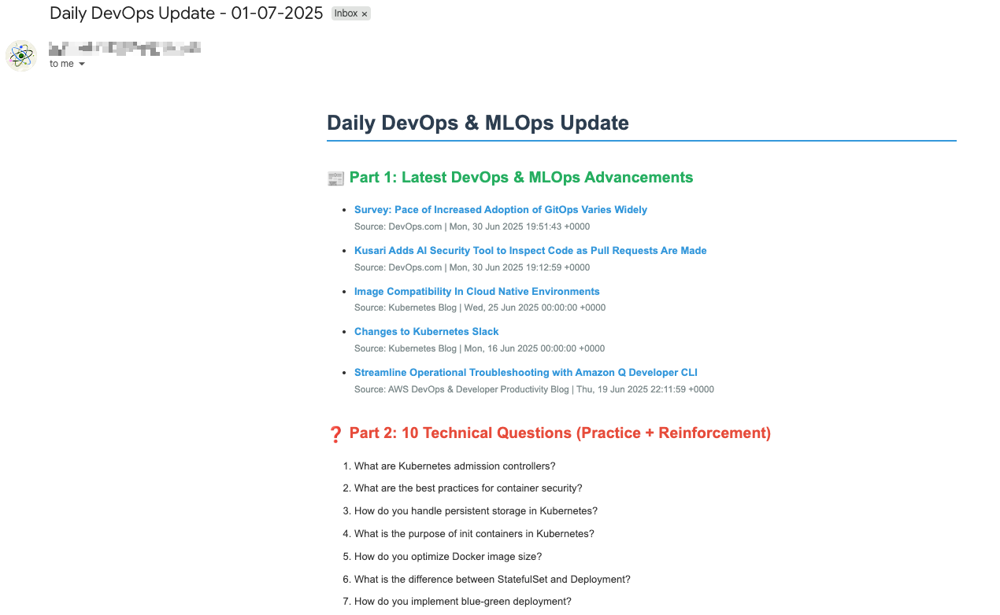

Daily DevOps Email Agent 

This is an Email Bot that performs the following tasks every day:

## Aggregates News from RSS Feeds
The bot collects news articles from multiple RSS feeds based on predefined keywords, ensuring only relevant and up-to-date information is fetched.

## Curates DevOps Questions
It selects and includes 10 carefully chosen DevOps-related questions daily. These are designed to help reinforce and solidify your understanding of core DevOps principles.

## Daily Inspirational Quote
Each email ends with an inspirational quote from a book of your choice, adding a thoughtful and reflective touch to your daily learning routine.

## Neat and Structured Formatting
All content—news items, questions, and the quote—is neatly formatted for clarity and readability in the email.

## Scheduled Delivery via Cron Job
The bot sends the compiled digest to a configured email address at a specific time each day, based on the cron schedule defined in the GitHub Actions workflow (YAML config file).

# Setup Instructions

## Prerequisites
1. GitHub account
2. Gmail account with 2FA enabled
3. Basic understanding of Python and GitHub Actions

## Step-by-Step Setup

### 1. Create GitHub Repository
- Create a new repository on GitHub
- Clone it to your local machine

### 2. Create Project Files
Create the following files in your repository:

**daily_agent.py** - Main Python script (see main_script above)
**requirements.txt** - Python dependencies
**.github/workflows/daily-email.yml** - GitHub Actions workflow

### 3. Set up Gmail App Password
1. Go to your Google Account settings
2. Enable 2-Factor Authentication if not already enabled
3. Go to Security > 2-Step Verification > App passwords
4. Generate a new app password for "Mail"
5. Copy the 16-character password (remove spaces)

### 4. Configure GitHub Secrets
Go to your repository Settings > Secrets and variables > Actions
Add these secrets:
- `EMAIL_USER`: Your Gmail address
- `EMAIL_PASSWORD`: The 16-character app password from Gmail
- `RECIPIENT_EMAIL`: Email address to receive daily updates

### 5. Test the Setup
1. Commit and push all files to GitHub
2. Go to Actions tab in your repository
3. Run the workflow manually to test
4. Check if email is received

### 6. Customize (Optional)
- Modify RSS feeds in the script
- Add more technical questions
- Adjust the cron schedule
- Customize email template

## Troubleshooting
- If emails weren't recieved, check GitHub Actions logs
- Ensure Gmail app password is correct
- Verify all secrets are set properly(IMPORTANT)
- Check spam folder for emails

## Cost: Completely Free!
- GitHub Actions: 2000 free minutes/month
- Gmail SMTP: Free

## Email That is recieved:

